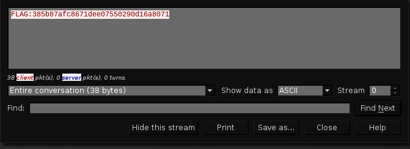

## easycap

> Can you get the flag from the packet capture?
>
>    [easycap.pcap](./lib/easycap.pcap)

#### WriteUp

Bài này cũng đúng với chữ easy .. Dùng `wireshark` để mở file lên, sau đó chọn `Follow` -> `TCP Stream` từ gói tin đầu tiên và ..

	

Úi, cái gì kia .. `FLAG:385b87afc8671dee07550290d16a8071`