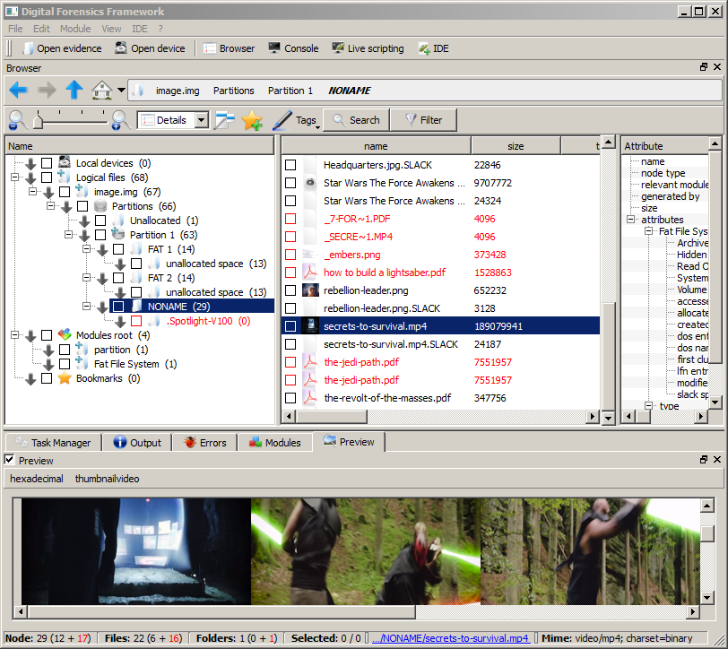

## Not Star Trek

> You've been hired as a Forensics expert. A special police force caught a rebel planning to destroy a military installation. I think this is related to some 'plans' we found transmitted earlier. They found a flashdrive on him, but didn't find anything useful. We took a DD image of the flash drive and are sending it to you. You're trying to find any information on their attack plans or organization. Good Luck.
> 
> [flashdrive.zip](https://drive.google.com/file/d/0BxBb6b3kX1G9NTdLVFR3LXE2Tkk/view)

#### Write-up

Đề bài cho 1 file `zip`, giải nén ra ta được 1 file `img` - `dd` cho phép sao chụp lại (imaging) một đĩa cứng một cách chính xác (bit-by-bit), đầu ra là một định dạng nguyên thủy (raw disk). [[1](http://forensicswiki.org/wiki/Dd)]

Thường thì ta sẽ cần khôi phục (recovering) một vài file bị xóa, để tìm được thứ cần tìm.

Hướng dẫn này sẽ sử dụng tool DFF (Digital Forensics Framework). [[2](https://github.com/arxsys/dff)]

- Mở file `dd` bằng DFF:

- Tìm kiếm các file bị xóa để tìm dữ liệu khả nghi: 
    + Các file bị xóa sẽ hiển thị màu đỏ.
    + Các file bắt đầu bằng ký tự `.` là file bị ẩn (hidden file) trong Linux.

- File `_embers.png` chứa flag cần tìm: `flag{you_found_the_rebel_alliance}`
