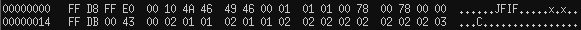

## Misc2

> Got an artefact file to be analysed. Can you please help me find the hidden data ? <br>
> [artefact](./lib/artefact)

#### WriteUp

Đầu tiên mình sẽ xác định dạng file với lệnh `file`

```
traioi$ file artefact
artefact: XZ compressed data
```
Tiếp theo, mình sẽ giải nén file XZ này.

```
traioi$ mv artefact artefact.xz
traioi$ unxz artefact.xz
```

Lại được 1 file `artefact` nữa nhưng có khác biệt ở dạng file.

```
traioi$ file artefact
artefact: Linux rev 1.0 ext3 filesystem data, UUID=c6666f0c-f641-4958-be07-bcc6540fdafd (large files)
```

Một file dạng ext3 bị lỗi. Mình sử dụng tool `extundelete` để recover data từ file này.

```
traioi$ extundelete artefact
NOTICE: Extended attributes are not restored.
Loading filesystem metadata ... 7 groups loaded.
Loading journal descriptors ... 2459 descriptors loaded.
Searching for recoverable inodes in directory / ... 
3359 recoverable inodes found.
Looking through the directory structure for deleted files ... 
0 recoverable inodes still lost.
```

```
traioi [RECOVERED_FILES]$ ls
total 56
drwxr-xr-x  4 traioi disk  4096 Feb 14 20:09 .
drwxr-xr-x 52 traioi disk 12288 Feb 14 20:09 ..
drwxr-xr-x  6 traioi disk  4096 Feb 14 20:11 file_system
drwxr-xr-x 23 traioi disk 36864 Feb 14 20:11 lost+found
```

Sau khi lục lọi 1 lúc thì mình tìm ra được 2 file đặc biệt.

```
traioi [file_system]$ cat 12\ OcjNU\ .txt
 flag text is somewhere inside 
```

Và 1 file `ts8U/c0pmcYvxe`, điểm đặc biệt của file này khi view hex là mình phát hiện được signature `..JFIF..` nhưng thiếu các  magical number `FFD8 FFE0` ở đầu.

<p align="center">
  
</p>

Sử dụng công cụ `hexedit` để thay đổi và lưu lại dưới dạng `.jpg`.

<p align="center">
  
</p>

Và mình nhận được file [c0pmcYvxe.jpg](./img/c0pmcYvxe.jpg).

<p align="center">
  
</p>

Bingo!! Flag là `flag{i_h@te_stupid_color$}`.
