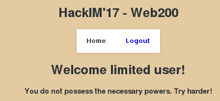
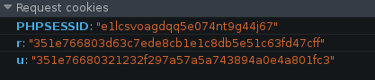
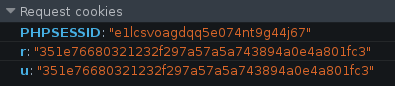
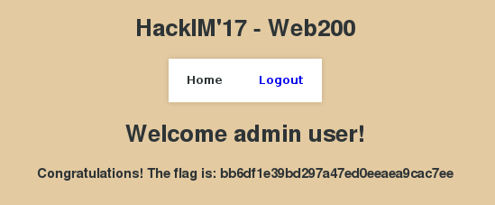

## Web2

> There are two kinds of people in this world. One with all the privileges and the others. Can you get the flag by eating some British biscuit? <br>
> http://54.152.19.210/web200/

#### WriteUp

Khi nhấn vào đường link phía trên, sẽ dẫn chúng ta vào một khung login. Thử đăng nhập với tài khoản `admin|admin` thì thế nào.

<p align="center">
  
</p>

Đăng nhập thành công, nhưng hình như có gì đó sai sai. Tại sao lại là `limited user` mà không phải là `admin user`?

Theo kinh nghiệm cho biết thì có thể có gì đó nằm ở cookie. Trong này, mình bắt được đoạn cookie có nội dung đáng nghi ngờ.

<p align="center">
  
</p>

Có thể là 1 đoạn hash gì đó. Nhưng khoan hãy xét tên của hash đó là gì, nhìn kỹ ở 2 đoạn hash có thể thấy phân đầu giống nhau `351e766803`, mặc dù không biết nó là gì nhưng mình sẽ lọc nó qua 1 bên và chỉ xét đoạn phía sau.

Có thể thấy đoạn hash phía sau ở 2 cookie là 32 kí tự, thông thường sẽ là md5. Thử dùng `john` để bruteforce nó và được kết quả là:

```
u:limited
r:admin
```

Vậy là đúng rồi, thử thay đổi phần `md5(limited)` thành `md5(admin)` xem nhé. Đoạn cookie sẽ có nội dung:

<p align="center">
  
</p>

<p align="center">
  
</p>

Bingo, vậy đã lấy được flag là: ` bb6df1e39bd297a47ed0eeaea9cac7ee`